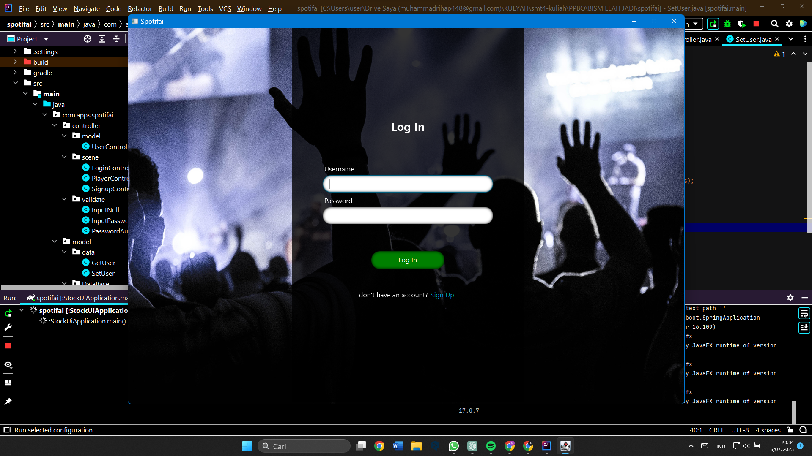
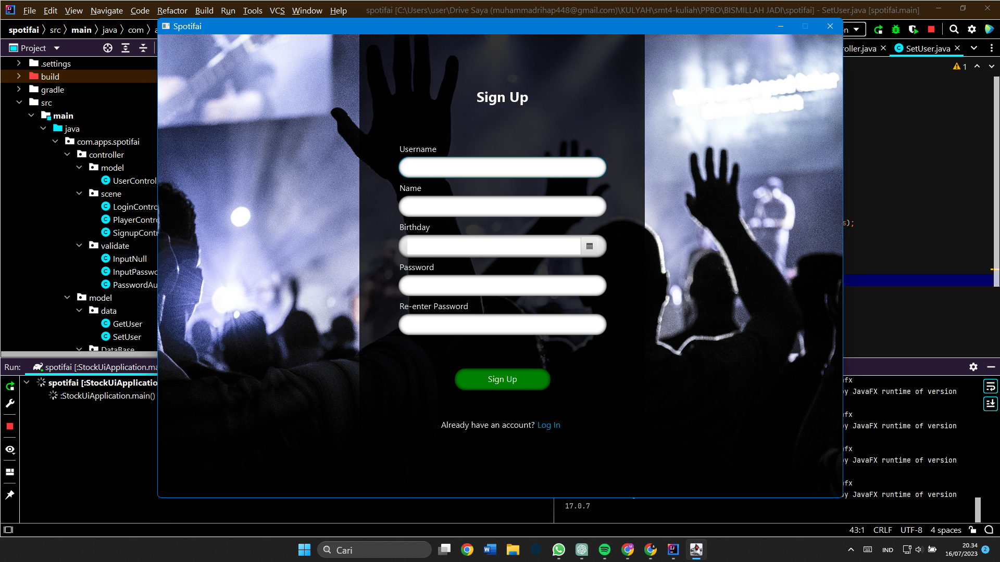
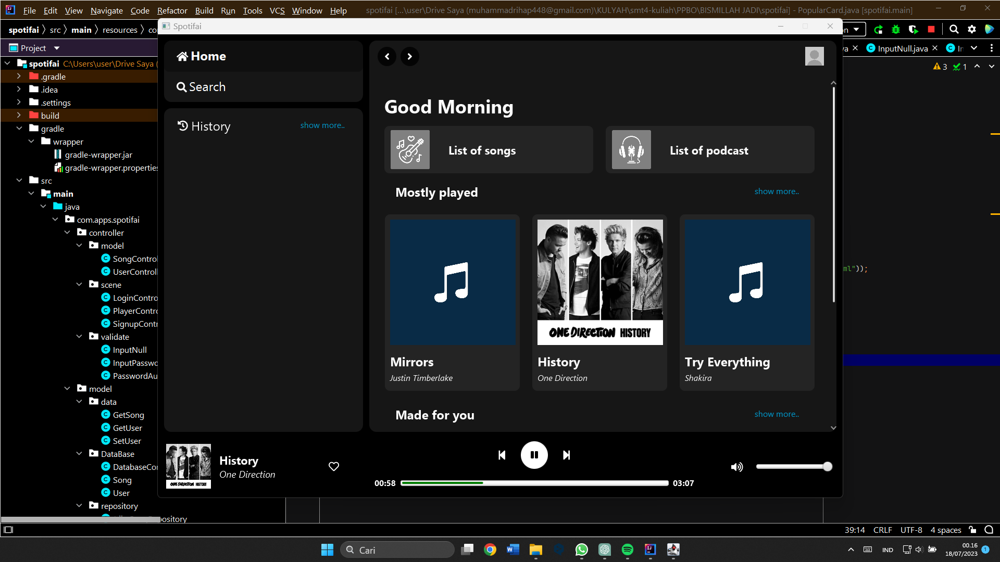

# SPOTIFAI CLONE

submission project for the course "object oriented programming"

### About

Proyek Spotify Clone menggunakan Java dengan Gradle non-modular; GUI menggunakan JavaFX, FXML dan CSS; Webservice menggunakan SpringBoot dan Jackson; Database menggunakan Spring Jdbc dan Server MySQL yang bisa diakses melalui db4free.net; Proyek ini juga menyimpan Login Session menggunakan Spring Session dengan Regis.

Sampai saat ini Poyek sudah bisa melakukan validasi login dan signup dengan pendekatan webservice, mendeteksi file musik yang ada di database, memutarnya dan berpindah antar lagu, serta mengatur volume dari lagu. Proyek ini akan terus berkembang.

### How To Run

you can run from main class 'com.apps.spotifai.StockUiApplication'

### Output

- Login page
  

- Signup page
  

- Dashboard
  
